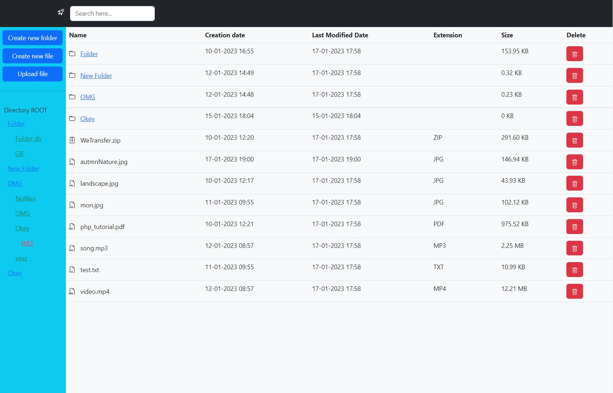
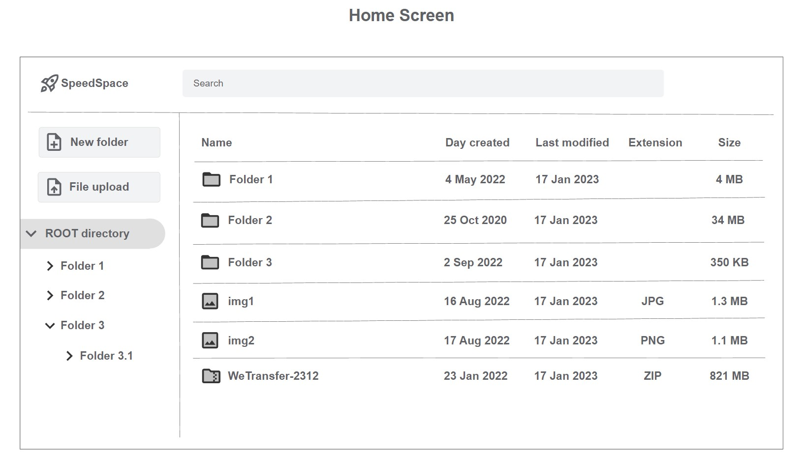
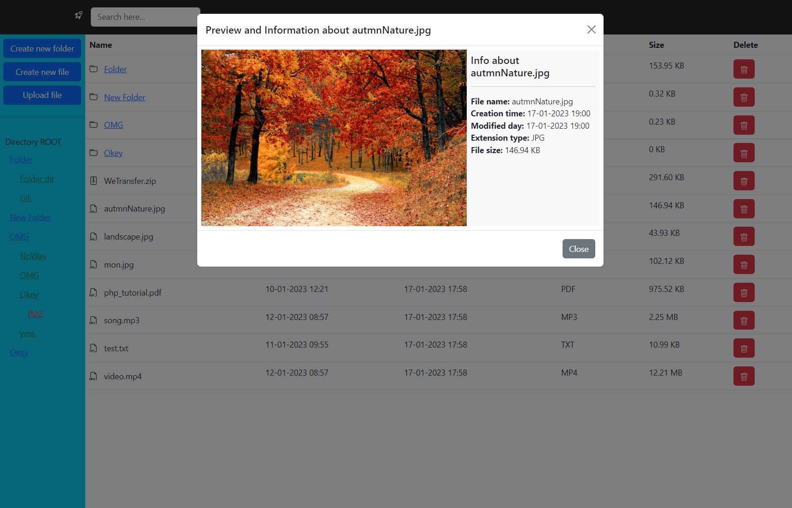
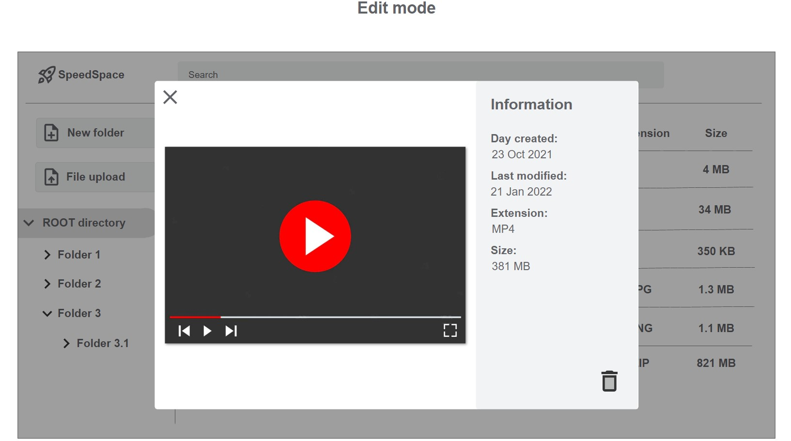

`#html` `#css` `#js` `#php` `#master-in-software-development`

# PHP Local FileSystem explorer <!-- omit in toc -->

  

>In this project we have created a system file explorer that allows the user to navigate, create directories and upload files in the same way as he would in his usual operating system. 

>The file explorer is a tool that allows you to directly view and manipulate the files and directories associated with a path, so you must take into account from which path the user starts and which path they can access.

## Index <!-- omit in toc -->

- [Requirements](#requirements)
- [Preview](#preview)
- [Technologies used](#technologies-used)
- [Project delivery](#project-delivery)
- [Contributors](#contributors-)
- [Resources](#resources)

## Requirements

- You cannot use file third-party libraries
- You will not be able to use global variables in PHP.
- You must use GIT
- You must use the PHP > v8
- Create a clear and orderly directory structure
- Both the code and the comments must be written in English
- Use the camelCase code style to define variables and functions
- In the case of using HTML, never use inline styles
- In the case of using different programming languages ​​always define the implementation in separate terms
- Remember that it is important to divide the tasks into several sub-tasks so that in this way you can associate each particular step of the construction with a specific commit
- You should try as much as possible that the commits and the planned tasks are the same
Delete files that are not used or are not necessary to evaluate the project

## Preview

This is the preview of FileSystem Main Body.

This is the preview of FileSystem Main Body File Preview.

## Technologies used

\* HTML

\* CSS

\* JS

\* PHP

## Contributors ✨

Thanks go to these wonderful people ([emoji key](https://allcontributors.org/docs/en/emoji-key)):

<!-- ALL-CONTRIBUTORS-LIST:START - Do not remove or modify this section -->
<!-- prettier-ignore-start -->
<!-- markdownlint-disable -->
<table>
  <tbody>
    <tr>
        <td align="center">
            <a href="https://github.com/joejoyjoy">
                
                 
                
                <b>Joe Alt</b>
                
            </a>
             
            <a href="#tools-dtpf" title="code-tools-maintenance-design">💻🔧🚧🎨</a>
        </td>
        <td align="center">
            <a href="https://github.com/pablohgb">
                
                 
                
                <b>Pablo Herrero</b>
                
            </a>
             
            <a href="#code-pablohgb" title="code-tools-maintenance-design">💻🔧🚧🎨</a>
        </td>
    </tr>
  </tbody>
</table>

This project follows the [all-contributors](https://allcontributors.org) specification.
Contributions of any kind are welcome!

## Resources

- [File system](https://es.wikipedia.org/wiki/Administrador_de_archivos)
- [PHP FileSystem W3C](https://www.w3schools.com/php/php_ref_filesystem.asp)
- [PHP FileSystem Oficial](https://www.php.net/manual/es/book.filesystem.php)
- [README Guidelines Example](https://gist.github.com/PurpleBooth/109311bb0361f32d87a2)

## License <!-- omit in toc -->

This project is licensed under the MIT License
